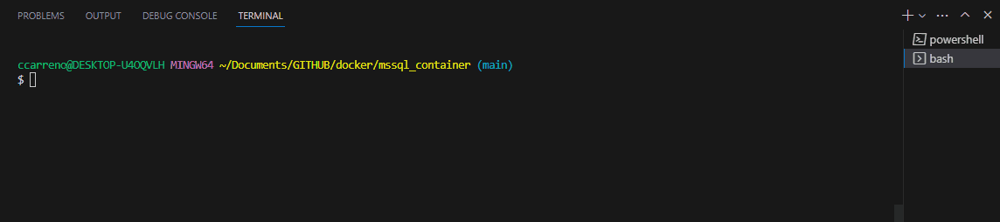
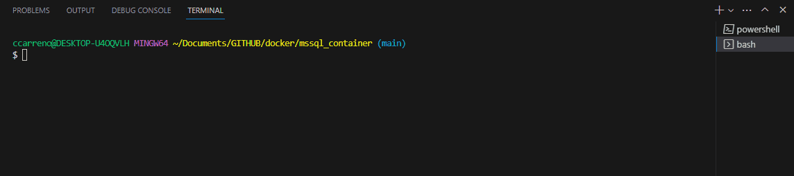
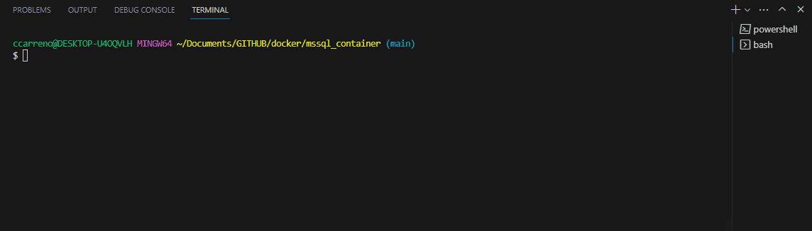

## MICROSOFT SQL SERVER 2022

Dockerfile for create MICROSOFT SQL SERVER 2022 .

### CREATE IMAGE

For create image from Dockerfile, executing following command:

```shell
docker build -t mssql-db-img:1.0.0 .
```


**NOTE:**

- mssql-db-img is the name image of builder docker.
- 1.0.0 is tag definition (generic use lastest).

### CREATE CONTAINER

For create container from image, executing following command:

```shell
docker run -p 1433:1433 -d --name mssql-container mssql-db-img:1.0.0
```



**NOTE:**

- 1433:1433 the first number is port publicate for local net and second number is default port database MICROSOFT SQL SERVER.
- mssql-container is the container name.

### CREATE CONTAINER WITH ENVIRONMENT

For create container from image with environment, we will have create file .env. Example:

**.env**

```
# EXAMPLE OVERRIDE SA PASSWORD
MSSQL_SA_PASSWORD=S4PasSW0rD2022
```

**NOTE:** For more information [MICROSOF DOCS](https://learn.microsoft.com/en-us/sql/linux/sql-server-linux-configure-environment-variables?view=sql-server-ver16).

For create container follow command:

```shell
docker run -p 1433:1433 -d --env-file .env --name mssql-container mssql-db-img:1.0.0
```
**NOTE:**

- .env is path file.

### STOP CONTAINER

For stop container, executing following command:

```shell
docker stop mssql-container
```



### REMOVE CONTAINER

For remove container, executing following command:

```shell
docker rm mssql-container
```

**NOTE:**

- The status of the container should be "stopped"


### LOGS CONTAINER

For view logs, executing following command:

```shell
docker logs -f mssql-container
```



